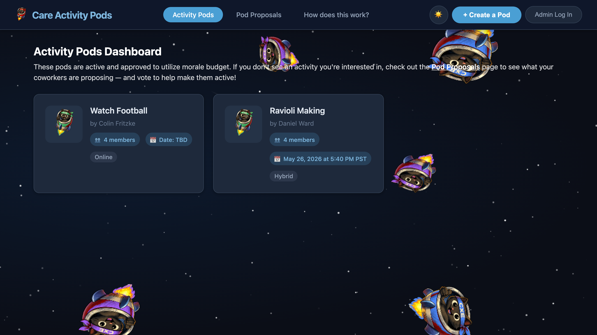
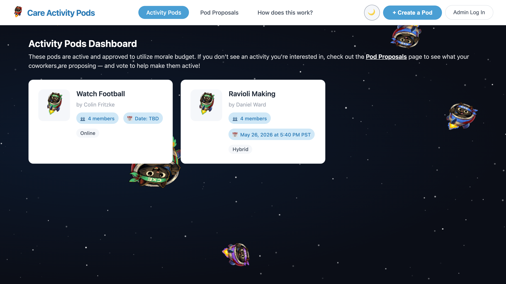
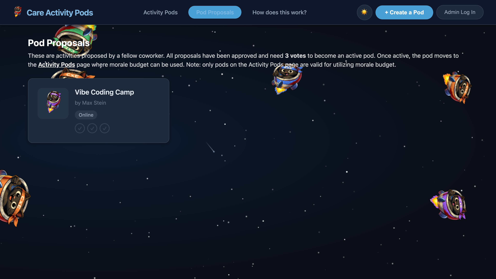
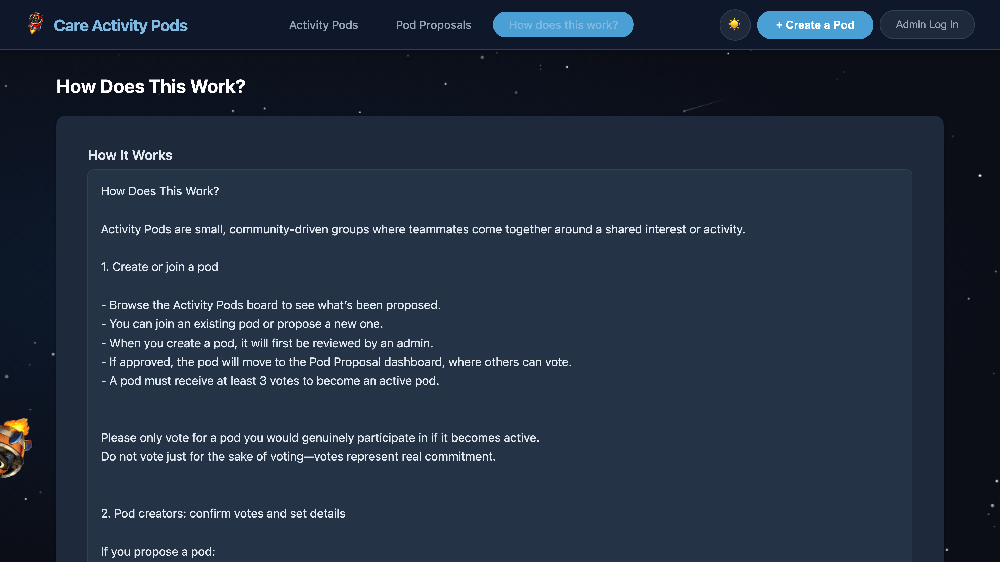
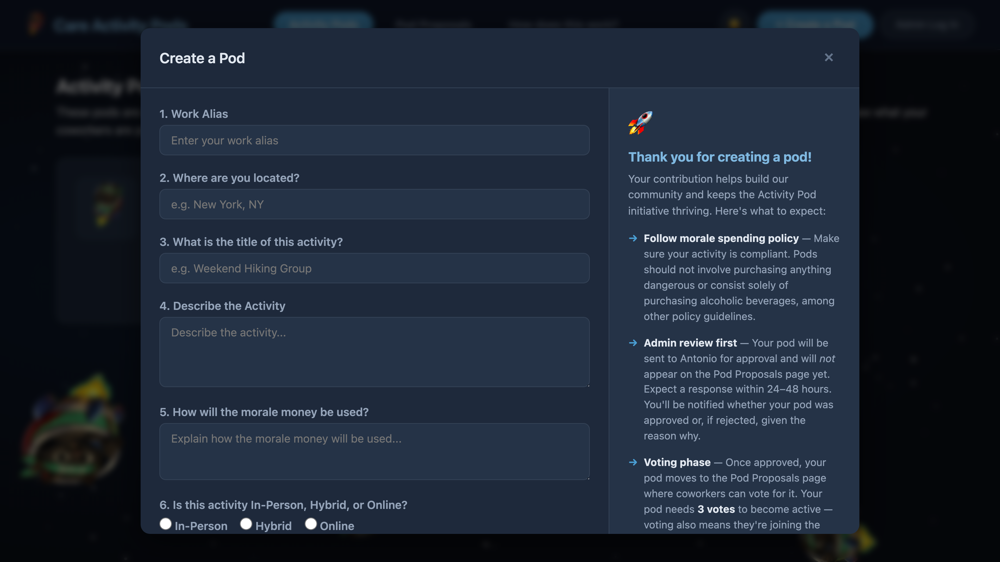
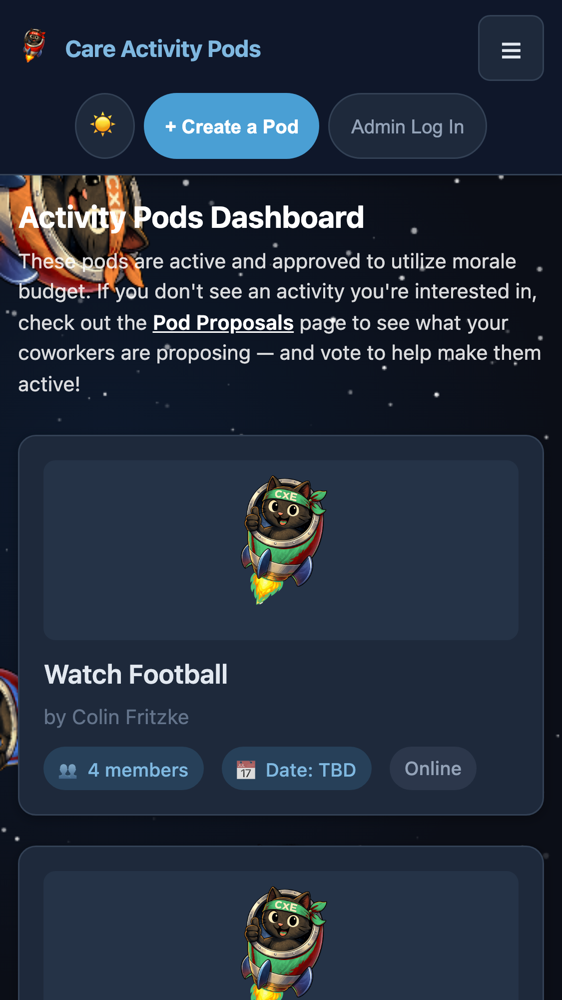
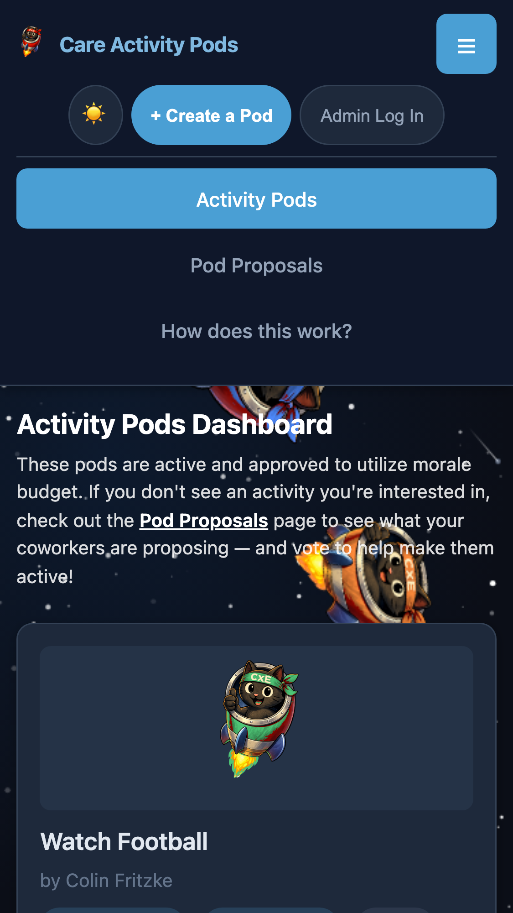

# 🐱🚀 Care Activity Pods

A community-driven platform for organizing and joining group activities — called **pods**. Whether it's a hiking trip, a cooking class, or a game night, pods make it easy to find people who share your interests.

Built with HTML, CSS, JavaScript, and Firebase Firestore. Features a space theme with floating rocket cats! 🌌



## ✨ Features

- **Activity Dashboard** — View all active pods with member counts and scheduled dates
- **Pod Proposals** — Browse proposed pods and vote to activate them
- **Create a Pod** — Submit a new activity idea with details and requirements
- **Join & Vote** — Join active pods or vote on proposals (3 votes to activate!)
- **Dark/Light Mode** — Toggle between dark space theme and clean light mode
- **Mobile Optimized** — Responsive design with hamburger menu for mobile devices
- **Admin Dashboard** — Review, approve, or reject pod proposals
- **Reporting** — View participation stats, activity breakdowns, and trends

## 📸 Screenshots

### Dashboard
| Dark Mode | Light Mode |
|:-:|:-:|
|  |  |

### Pod Proposals & How It Works
| Proposals | How It Works |
|:-:|:-:|
|  |  |

### Create a Pod


### Mobile Views
| Dashboard | Navigation Menu |
|:-:|:-:|
|  |  |

## 🛠 Tech Stack

- **Frontend**: HTML5, CSS3, Vanilla JavaScript
- **Backend**: Firebase Firestore (real-time NoSQL database)
- **Theme**: CSS custom properties with dark/light mode support
- **Testing**: Playwright (visual regression + fit-and-finish tests)
- **Hosting**: GitHub Pages / Firebase Hosting / Netlify / Vercel

## 🚀 Getting Started

### Prerequisites
- A modern web browser
- Node.js (for running tests)

### Running Locally
```bash
# Clone the repository
git clone https://github.com/AAlejandro96/care-passion-pods.git
cd care-passion-pods

# Open in browser
open index.html
# Or serve locally
npx serve .
```

The app connects to Firebase Firestore, so data is shared in real-time across all visitors.

### Running Tests
```bash
# Install dependencies
npm install

# Run all tests
npm test

# Run fit-and-finish tests only
npm run test:fit

# Run screenshot tests only
npm run test:screenshots
```

## 📁 Project Structure

```
care-passion-pods/
├── index.html          # Main HTML page
├── styles.css          # All styles (light/dark themes, responsive)
├── app.js              # App logic and Firebase integration
├── theme.js            # Dark/light mode toggle
├── space.js            # Space background animation (stars, shooting stars, cats)
├── favicon.svg         # SVG favicon (space cat)
├── logo.png            # App logo
├── cat-*.png           # Rocket cat images (blue, orange, green, purple)
├── playwright.config.js
├── tests/
│   ├── fit-and-finish.spec.js  # UI polish and functionality tests
│   └── screenshots.spec.js     # Screenshot capture for README
└── screenshots/        # Auto-generated screenshots
```

## 🌗 Dark & Light Mode

The app defaults to dark mode with a space-themed background featuring twinkling stars, shooting stars, and floating rocket cats. Toggle to light mode for a clean, bright interface. Your preference is saved to localStorage.

## 📱 Mobile Support

Fully responsive with:
- Hamburger navigation menu on screens ≤768px
- Touch-friendly 44px minimum tap targets
- Stacked layouts for cards and forms
- Full-width modals on small screens
- Additional optimizations at 480px for small phones

## 🤝 How It Works

1. **Create** — Submit a pod idea via "Create a Pod"
2. **Review** — Admin reviews and approves the proposal
3. **Vote** — Approved pods appear on Pod Proposals for voting
4. **Activate** — 3 votes activates the pod and moves it to the dashboard
5. **Join** — Anyone can join active pods from the dashboard

## 👤 About

Created by **Antonio Alejandro** — helping teams build connections through shared activities.

## 📄 License

This project is open source.
